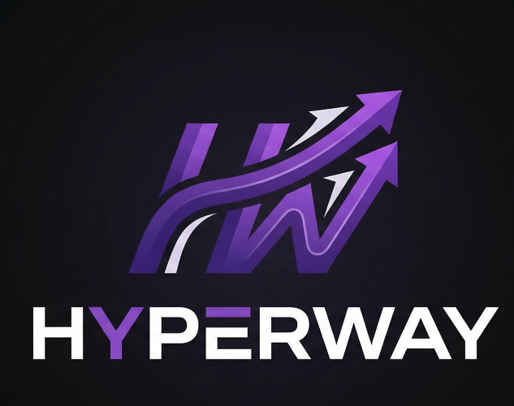
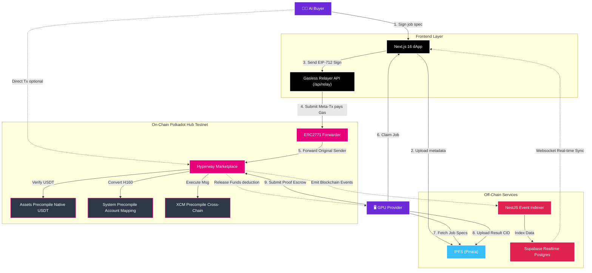

<p align="center">
  
</p>

<h1 align="center">Hyperway</h1>
<p align="center">
  <strong>Decentralized GPU Compute Marketplace on Polkadot Hub</strong>
</p>

<p align="center">
  <a href="https://polkadot.com/"></a>
  <a href="https://docs.openzeppelin.com/contracts/"></a>
  <a href="https://book.getfoundry.sh/"></a>
  <a href="https://nextjs.org/"></a>
</p>

<p align="center">
  <em>Built for the <a href="https://www.polkadotsolidity.com/">Polkadot Solidity Hackathon</a> — Track 2: PVM Smart Contracts  &  OpenZeppelin Sponsor Track</em>
</p>

---

## Table of Contents

- [Overview](#overview)
- [The Problem](#the-problem)
- [How Hyperway Works](#how-hyperway-works)
- [Track 2 — PVM Smart Contracts](#track-2--pvm-smart-contracts)
- [OpenZeppelin Integration (Sponsor Track)](#openzeppelin-integration-sponsor-track)
- [Architecture](#architecture)
- [Smart Contract Design](#smart-contract-design)
- [Frontend](#frontend)
- [Backend Indexer](#backend-indexer)
- [Getting Started](#getting-started)
- [Demo & Screenshots](#demo--screenshots)
- [Roadmap](#roadmap)
- [Team](#team)

---

## Overview

**Hyperway** is a trustless, on-chain GPU compute marketplace deployed natively on **Polkadot Hub**. It connects AI researchers and developers who need GPU compute power with providers who have spare capacity — all secured by smart contract escrow, collateral staking, and Polkadot's shared security model.

Unlike centralized GPU marketplaces (Lambda, RunPod, Vast.ai), Hyperway eliminates intermediaries. Payments are escrowed on-chain, providers stake collateral that can be slashed for non-delivery, and job specifications are stored immutably on IPFS.

### Key Highlights

| Feature                          | Description                                                                      |
| -------------------------------- | -------------------------------------------------------------------------------- |
| 🔐 **Smart Contract Escrow**     | Buyer funds are locked until proof-of-compute is verified                        |
| 🌐 **XCM Cross-Chain Payments**  | Pay from any parachain via raw XCM V5 instructions (precompile `0xA0000`)        |
| 💵 **Native USDT Payments**      | Accept Polkadot-native USDT (Asset ID 1984) via the Assets precompile            |
| ⚡ **Gasless Meta-Transactions** | Zero-gas job submission via OpenZeppelin ERC2771 forwarder                       |
| 🗄️ **IPFS Job Specs**            | Decentralized storage of job specifications and compute results                  |
| 📊 **Real-Time Dashboard**       | Live marketplace stats, job tracking, and provider management                    |
| 🛡️ **Slashing & Disputes**       | Provider collateral is at risk — automated timeout slashing + dispute resolution |

---

## The Problem

The AI compute market is experiencing explosive growth, yet it remains dominated by centralized providers with opaque pricing, vendor lock-in, and geographic restrictions. Researchers in APAC, Africa, and Latin America face inflated prices and limited access to high-end GPUs.

**Hyperway solves this by:**

1. **Decentralizing the marketplace** — Anyone with a GPU can become a provider, removing gatekeepers.
2. **Trustless payments** — Smart contract escrow removes counterparty risk for both buyers and providers.
3. **Multi-asset flexibility** — Pay in DOT, USDT, or tokens from other parachains via XCM.
4. **Zero-friction onboarding** — Gasless transactions let new users submit jobs without holding native tokens for gas.

---

## How Hyperway Works

```
┌────────────┐     ┌──────────────────┐     ┌───────────────┐
│  AI Buyer  │────▶│   Hyperway dApp  │────▶│  GPU Provider │
│            │     │   (Next.js 16)   │     │               │
│  1. Define │     │                  │     │  4. Claim Job  │
│     job    │     │  2. Upload spec  │     │  5. Execute    │
│  3. Escrow │     │     to IPFS      │     │  6. Submit     │
│     DOT    │     │                  │     │     proof      │
└────────────┘     └────────┬─────────┘     └───────────────┘
                            │
                 ┌──────────▼──────────┐
                 │  HyperwayMarketplace │
                 │   (Polkadot Hub)     │
                 │                      │
                 │  • Escrow DOT/USDT   │
                 │  • Track job status   │
                 │  • Slash collateral   │
                 │  • Release payment    │
                 │  • XCM cross-chain    │
                 └──────────────────────┘
```

**Step-by-step flow:**

1. **Buyer** defines a compute job (model, framework, VRAM, duration) and uploads it to IPFS.
2. **Buyer** submits the job on-chain, escrowing payment in DOT, USDT, or via XCM from another chain.
3. **Provider** (staked GPU operator) claims the job from the marketplace.
4. **Provider** executes the compute workload, producing results.
5. **Provider** submits a proof-of-compute with the result CID — payment is automatically released minus the platform fee.
6. If the provider fails to deliver, the **buyer** can slash the provider's collateral after the deadline.

---

## Track 2 — PVM Smart Contracts

## Track 2 — PVM Smart Contracts

Hyperway is strategically built for **Track 2: PVM Smart Contracts** on Polkadot Hub, leveraging native runtime features that extend beyond standard EVM capabilities:

### Native Asset Integration (Category 2)

Hyperway implements deep integration with **Polkadot Native USDT (Asset ID 1984)**. By utilizing the deterministic Assets precompile, the marketplace facilitates trustless escrow using the canonical asset managed by the Polkadot Assets pallet.

- **Direct Accessibility:** No wrapped versions or bridges; the contract interacts directly with the system-level asset.
- **ERC-20 Compatibility:** Utilizes the native ERC-20 interface exposed by Polkadot Hub for seamless integration with existing Solidity patterns.

### Polkadot Native Functionality via Precompiles (Category 3)

We utilize Polkadot Hub’s specialized precompiles to achieve cross-chain interoperability and deterministic account mapping:

- **XCM V5 Precompile (`0xA0000`):** Enables cross-chain payment settlement using raw, SCALE-encoded XCM instructions. This allows users to pay for compute using assets located on other parachains.
- **System Precompile (`0x0900`):** Performs critical H160 (EVM) to AccountId32 (Substrate) conversion, ensuring that XCM beneficiaries are correctly mapped for multi-chain delivery.

**XCM V5 Integration** — The contract executes raw, SCALE-encoded XCM V5 instructions (not wrapped in `VersionedXcm`):

```solidity
function submitJobWithXCM(
    bytes32 specCID,
    uint256 computeUnits,
    bytes calldata xcmMessage // Raw SCALE-encoded XCM V5 instructions
) external whenNotPaused nonReentrant returns (uint256) {
    uint256 balanceBefore = address(this).balance;

    // 1. Weigh the XCM message
    (bool weighOk, bytes memory weighRet) = XCM_PRECOMPILE.call(
        abi.encodeCall(IXcm.weighMessage, (xcmMessage))
    );
    (uint64 refTime, uint64 proofSize) = abi.decode(weighRet, (uint64, uint64));

    // 2. Execute the XCM message (deposits tokens into this contract)
    (bool execOk, ) = XCM_PRECOMPILE.call(
        abi.encodeCall(IXcm.execute, (xcmMessage, IXcm.Weight(refTime, proofSize)))
    );

    // 3. Verify funds were received
    uint256 xcmPayment = address(this).balance - balanceBefore;
    if (xcmPayment == 0) revert XCMNoFundsReceived();
    // ... create job with xcmPayment
}
```

**H160 → AccountId32 Mapping** — For XCM messages that require Substrate-native account identifiers:

```solidity
function getSubstrateAccountId(address evmAddress) external pure returns (bytes32) {
    // Polkadot Hub maps H160 to AccountId32 by padding with 0xEE
    bytes20 addrBytes = bytes20(evmAddress);
    bytes12 padding = 0xEEEEEEEEEEEEEEEEEEEEEEEE;
    return bytes32(abi.encodePacked(addrBytes, padding));
}
```

---

## OpenZeppelin Integration (Sponsor Track)

Hyperway goes beyond standard token deployments. We use **four OpenZeppelin contract libraries** as composable security primitives, each serving a specific role in the marketplace architecture:

### 1. `ERC2771Context` — Gasless Meta-Transactions

This is the cornerstone of our onboarding UX. New users can submit compute jobs **without holding any native tokens for gas**.

```solidity
import {ERC2771Context} from "@openzeppelin/contracts/metatx/ERC2771Context.sol";

contract HyperwayMarketplace is ERC2771Context, ReentrancyGuard, Ownable, Pausable {
    constructor(
        address _feeRecipient,
        address _trustedForwarder  // ← ERC2771 forwarder
    ) ERC2771Context(_trustedForwarder) Ownable(msg.sender) { ... }
}
```

**How it works in Hyperway:**

1. The buyer **signs a message** in MetaMask (no gas prompt).
2. Our **relay API** (`/api/relay`) receives the signed message and submits the transaction on behalf of the user, paying gas from a relayer wallet.
3. The contract resolves the **original sender** via `_msgSender()` (not `msg.sender`), ensuring the job is correctly attributed to the buyer.

**Why this matters:** In many regions, acquiring native tokens for gas is a significant onboarding barrier. ERC2771 eliminates this entirely, making GPU compute accessible to anyone with a wallet.

The `_msgSender()` / `_msgData()` / `_contextSuffixLength()` overrides resolve the ERC2771Context diamond inheritance with `Ownable` and `Pausable`:

```solidity
// Resolve the Context diamond (ERC2771Context vs Ownable/Pausable)
function _msgSender() internal view override(Context, ERC2771Context)
    returns (address) {
    return ERC2771Context._msgSender();
}
```

### 2. `ReentrancyGuard` — Protection Against Reentrancy Attacks

Every function that transfers value (escrow release, staking, slashing, refunds) is protected by `nonReentrant`:

```solidity
function submitProof(...) external nonReentrant { ... }
function cancelJob(...)   external nonReentrant { ... }
function slashProvider(...) external nonReentrant { ... }
function withdrawStake()  external nonReentrant { ... }
```

This is critical because Hyperway's escrow model involves multiple `call{value: ...}` transfers in a single transaction (provider payment + platform fee), which is a classic reentrancy vector.

### 3. `Ownable` — Role-Based Administrative Control

The contract owner can:

- Update the platform fee (capped at 10% maximum via `InvalidFee` error)
- Adjust the minimum provider stake requirement
- Change the fee recipient address
- Resolve disputes (interim — DAO governance planned)
- Pause/unpause the marketplace in emergencies

```solidity
function setPlatformFee(uint256 newFeeBps) external onlyOwner {
    if (newFeeBps > 1000) revert InvalidFee(newFeeBps); // Max 10%
    platformFeeBps = newFeeBps;
}
```

### 4. `Pausable` — Emergency Circuit Breaker

The marketplace can be paused to halt all new job submissions and provider registrations if a vulnerability or exploit is detected:

```solidity
function registerProvider(...) external payable whenNotPaused { ... }
function submitJob(...)        external payable whenNotPaused { ... }
function submitJobWithUSDT(...) external whenNotPaused nonReentrant { ... }
function submitJobWithXCM(...)  external whenNotPaused nonReentrant { ... }
```

### Composition Summary

| Library           | Non-Trivial Usage                                                                                               |
| ----------------- | --------------------------------------------------------------------------------------------------------------- |
| `ERC2771Context`  | Gasless meta-transaction relay with diamond inheritance resolution for `_msgSender()` across Ownable + Pausable |
| `ReentrancyGuard` | Guards 5 functions that perform multi-transfer escrow operations (provider + fee split)                         |
| `Ownable`         | Fee governance with hard-coded 10% cap, dispute resolution, emergency controls                                  |
| `Pausable`        | Granular circuit-breaker on 4 state-changing functions without affecting withdrawals                            |

---

## Architecture



### Directory Structure

```text
hyperway/
├── hyperway-contracts/          # Solidity smart contracts (Foundry)
│   ├── src/
│   │   ├── HyperwayMarketplace.sol   # Core marketplace (895 lines)
│   │   └── interfaces/
│   │       ├── IXCM.sol              # XCM precompile interface (V5)
│   │       └── ISystem.sol           # System precompile interface
│   ├── script/
│   │   ├── Deploy.s.sol              # Deployment script
│   │   ├── CheckUSDT.s.sol           # USDT balance checker
│   │   └── DeployDummyUSDT.s.sol     # Test token deployment
│   ├── test/                         # Forge tests
│   ├── foundry.toml                  # Foundry config (Solc 0.8.28, via_ir)
│   └── lib/                          # OpenZeppelin + forge-std
│
├── hyperway-frontend/           # Next.js 16 (React 19) frontend
│   ├── app/
│   │   ├── marketplace/              # Browse & claim jobs
│   │   ├── submit-job/               # Submit compute jobs (USDT/DOT/XCM)
│   │   ├── dashboard/                # Provider work dashboard
│   │   ├── provider-dashboard/       # Provider registration & management
│   │   ├── my-jobs/                  # Buyer job tracking
│   │   └── api/                      # Next.js API routes
│   │       ├── ipfs/                 # IPFS upload (Pinata)
│   │       └── relay/                # ERC2771 gasless relay
│   ├── hooks/
│   │   ├── useMarketplace.ts         # Contract interaction hooks
│   │   └── useIPFS.ts                # IPFS upload/download hooks
│   └── lib/
│       ├── ipfs.ts                   # Client-safe IPFS utilities
│       └── ipfs-server.ts           # Server-side Pinata SDK
│
├── hyperway-backend/            # NestJS event indexer
│   └── src/                         # Blockchain event listener → Supabase
│
└── README.md                    # ← You are here
```

---

## Smart Contract Design

### `HyperwayMarketplace.sol` — 895 Lines

The contract manages the full lifecycle of a GPU compute job:

```
PENDING → ASSIGNED → COMPLETED
   │         │
   │         └──→ FAILED (timeout + slash)
   │         └──→ DISPUTED → RESOLVED
   │
   └──→ FAILED (cancelled by buyer)
```

**Provider Economics:**

- Providers stake **DOT collateral** (minimum configurable by owner).
- Provider reputation is tracked on-chain: `reputationScore = (completedJobs / totalJobs) × 100`.
- Non-delivery results in **10% collateral slashing** + automatic deactivation if stake drops below minimum.

**Payment Flow:**

- Platform fee: **2.5%** (configurable, capped at 10%).
- Provider receives `paymentAmount - fee`.
- Fee goes to a configurable `feeRecipient` address.

**Three Payment Methods:**

| Method          | Function              | Token                | Mechanism                             |
| --------------- | --------------------- | -------------------- | ------------------------------------- |
| Native DOT      | `submitJob()`         | DOT                  | `msg.value` escrow                    |
| Native USDT     | `submitJobWithUSDT()` | USDT (Asset ID 1984) | ERC-20 `transferFrom` via precompile  |
| XCM Cross-Chain | `submitJobWithXCM()`  | Any supported asset  | Raw V5 `execute()` via XCM precompile |

---

## Frontend

Built with **Next.js 16**, **React 19**, **Wagmi v2**, and **RainbowKit** for wallet connectivity.

### Pages

| Page                  | Description                                                  |
| --------------------- | ------------------------------------------------------------ |
| `/marketplace`        | Browse all jobs, filter by status, claim jobs as provider    |
| `/submit-job`         | Full job creation wizard with USDT/DOT/XCM payment selection |
| `/dashboard`          | Provider workspace — manage assigned jobs, submit proofs     |
| `/provider-dashboard` | Register as provider, manage stake, view reputation          |
| `/my-jobs`            | Buyer view — track submitted jobs and their status           |
| `/connect`            | Wallet connection page with MetaMask/WalletConnect           |

### Design Language

- **Neo-brutalist UI** with purple/black color palette, thick borders, and bold typography.
- **Real-time updates** via Supabase realtime subscriptions.
- **Substrate address display** — Shows mapped AccountId32 in the navbar for XCM operations.
- **Multi-step submission flow** — Upload → Sign → Confirm progress indicator.

---

## Backend Indexer

A **NestJS** service that listens to on-chain events and indexes them into **Supabase** for fast querying:

- `JobSubmitted` → Inserts new job with IPFS spec metadata
- `JobAssigned` → Updates job status and provider
- `ProofSubmitted` / `JobCompleted` → Updates results and payment info
- `ProviderRegistered` → Indexes provider details
- `ProviderSlashed` → Records slashing events

This ensures the frontend can query jobs with full-text search, filtering, and sorting without hitting the blockchain for every request.

---

## Getting Started

### Prerequisites

- **Node.js** ≥ 18
- **Foundry** (for smart contract compilation and deployment)
- **MetaMask** configured for [Polkadot Hub Testnet](https://docs.polkadot.com/)
  - Chain ID: `420420417`
  - RPC: `https://eth-rpc-testnet.polkadot.io/`

### 1. Clone the Repository

```bash
git clone https://github.com/Nebulaz7/hyperway.git
cd hyperway
```

### 2. Smart Contracts

```bash
cd hyperway-contracts

# Install dependencies
forge install

# Compile
forge build

# Deploy to Polkadot Hub Testnet
forge script script/Deploy.s.sol:Deploy \
  --rpc-url https://testnet-paseo-rpc.polkadot.io \
  --broadcast \
  --private-key $PRIVATE_KEY
```

### 3. Frontend

```bash
cd hyperway-frontend

# Install dependencies
npm install

# Set environment variables
cp .env.example .env.local
# Edit .env.local with your contract address, Pinata JWT, Supabase keys

# Run development server
npm run dev
```

### 4. Backend Indexer

```bash
cd hyperway-backend

# Install dependencies
npm install

# Set environment variables
cp .env.example .env
# Edit .env with RPC URL, contract address, Supabase keys

# Start indexer
npm run start:dev
```

### Environment Variables

| Variable                        | Description                                           |
| ------------------------------- | ----------------------------------------------------- |
| `NEXT_PUBLIC_CONTRACT_ADDRESS`  | Deployed HyperwayMarketplace address                  |
| `NEXT_PUBLIC_CHAIN_ID`          | `420420417` (Polkadot Hub Testnet)                    |
| `PINATA_JWT`                    | Pinata API key for IPFS uploads                       |
| `NEXT_PUBLIC_PINATA_GATEWAY`    | Pinata gateway domain                                 |
| `NEXT_PUBLIC_SUPABASE_URL`      | Supabase project URL                                  |
| `NEXT_PUBLIC_SUPABASE_ANON_KEY` | Supabase anonymous key                                |
| `RELAY_PRIVATE_KEY`             | Relayer wallet private key (for gasless transactions) |

---

## Demo & Screenshots

> 📹 **Demo Video:** [https://youtu.be/-OUbqGwyobY](https://youtu.be/-OUbqGwyobY)

### Marketplace

Browse available GPU compute jobs, view providers, and claim work.

### Submit Job

Full-featured job submission with USDT/DOT payment toggle, XCM option, and gasless meta-transactions.

### Provider Dashboard

Register as a provider, stake collateral, manage GPU availability, and track reputation.

---

## Roadmap

| Phase       | Milestone                                     | Status   |
| ----------- | --------------------------------------------- | -------- |
| ✅ Phase 1  | Smart contract with escrow, staking, slashing | Complete |
| ✅ Phase 2  | Next.js frontend with marketplace UI          | Complete |
| ✅ Phase 3  | XCM cross-chain payments via precompile       | Complete |
| ✅ Phase 4  | Native USDT integration (Asset ID 1984)       | Complete |
| ✅ Phase 5  | Gasless meta-transactions (ERC2771)           | Complete |
| ✅ Phase 6  | NestJS event indexer + Supabase               | Complete |
| 🔜 Phase 7  | On-chain proof verification (ZK proofs)       | Planned  |
| 🔜 Phase 8  | DAO governance for dispute resolution         | Planned  |
| 🔜 Phase 9  | Multi-GPU job orchestration                   | Planned  |
| 🔜 Phase 10 | Provider auto-matching algorithm              | Planned  |

---

## Why Polkadot?

We chose Polkadot Hub specifically because of its **unique advantages** that no other EVM-compatible chain offers:

1. **Native Precompiles** — Direct access to XCM, System, and Assets pallets from Solidity. No middleware, no bridges, no third-party contracts.

2. **XCM (Cross-Consensus Messaging)** — Payments can originate from any Polkadot parachain. A GPU buyer on Astar or Moonbeam can pay for compute on Polkadot Hub without bridging.

3. **Shared Security** — Every transaction is secured by Polkadot's Nominated Proof of Stake, one of the most decentralized validator sets in the industry.

4. **Native Assets** — USDT on Polkadot Hub is not a wrapped token. It's the canonical asset managed by the Assets pallet, accessible through a deterministic ERC-20 precompile.

5. **Low Fees** — Polkadot Hub's fee structure makes micro-payments for GPU compute economically viable, unlike Ethereum mainnet.

---

## Tech Stack

| Layer           | Technology                                                |
| --------------- | --------------------------------------------------------- |
| Smart Contracts | Solidity 0.8.28, Foundry, OpenZeppelin Contracts v5       |
| Frontend        | Next.js 16, React 19, Wagmi v2, RainbowKit, Framer Motion |
| Backend         | NestJS, Supabase (PostgreSQL + Realtime)                  |
| Storage         | IPFS (Pinata)                                             |
| Chain           | Polkadot Hub (Chain ID 420420417 testnet)                 |
| Tooling         | Foundry (forge, cast, anvil), WSL for deployment          |

---

## Team

Built with ❤️ for the **Polkadot Solidity Hackathon** by the Hyperway team.

---

## License

MIT License — see [LICENSE](./LICENSE) for details.
